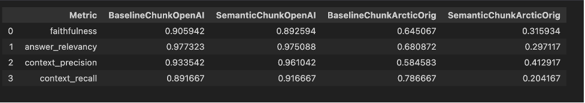
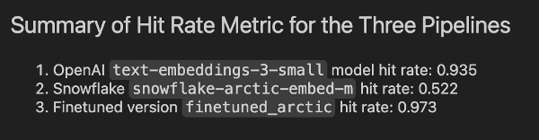
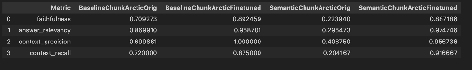

# AI Engineering Cohort#4 Midterm Assignment
Vinod Chandrashekaran

September 2024

In case you are interested in reviewing the code, these two notebooks contain all the work done for the Midterm Assignment.

[Main Notebook](vc_aie4_midterm_rag_and_ragas_pipelines.ipynb) : contains all the RAG setup and RAG/RAGAS evaluations.

[FinetuningPipeline](vc_completed_aie4_midterm_finetuning_embeddings_pipeline.ipynb) : contains the finetuning pipeline.

Note that both notebooks make heavy use of the modules I have prepared by refactoring the code from various exercises.  The refactored code, packaged into modules, can be found [here](myutils).

This document is part of the submission for the AIE Cohort#4 midterm assignment!  I am using this document to formally write out the responses to the deliverables stated on the assignment page.  

A copy of these notes has been posted to this repo and is available as a pdf version here.

https://github.com/vincha77/AIE4_Midterm/blob/main/myNotes/vc_aie4_midterm_assignment_document_with_responses_to_Tasks_and_Questions.pdf

The PDF version posted here may be a bit more readable!  

However, if you want to get access to the embedded links, those links are not working on the pdf version!!! You can find the links in the copy below!!

You can also access the MS Word version here - the raw form of the Word doc can be downloaded and the embedded links are active there!

https://github.com/vincha77/AIE4_Midterm/blob/main/myNotes/vc_aie4_midterm_assignment_document_with_responses_to_Tasks_and_Questions.docx

# My Final Submission

1.	A public link to a written report addressing each deliverable and answering each question.

Link to this report

https://github.com/vincha77/AIE4_Midterm/blob/main/README.md

2.	A public link to any relevant GitHub repo.

Link to github repo
https://github.com/vincha77/AIE4_Midterm

3.	A public link to the final version of your application on Hugging Face.

Link to HF app
https://huggingface.co/spaces/vincha77/aie4_midterm_app

4.	A public link to your fine-tuned embedding model on Hugging Face.

Here is the link to fine-tuned embedding model on HF hub

Model is called: “vincha77/finetuned_arctic”

https://huggingface.co/vincha77/finetuned_arctic

5.	EXTRA!!!! Link to Loom Video showcasing the fast prototype
Prototype deployed to HF Spaces and tested there.
Here is a link to Loom video showing the prototype app in a live demo:
https://www.loom.com/share/3396b23b33f445ffb531ddcc8858487e

# Task 1: Dealing with the Data
Review the two PDFs and decide how best to chunk up the data with a single strategy to optimally answer the variety of questions you expect to receive from people.  
Hint: Create a list of potential questions that people are likely to ask!

A. Review of documents

2022: Blueprint for an AI Bill of Rights: Making Automated Systems Work for the American People
This is really two docs in one
first doc sets up five principles and practices
second one is labeled a technical companion; it expands on each principle as well as how to operationalize it; each principle is reiterated, followed by an articulation of what the principle is important, what should be expected of automated systems in regard to following this principle, and examples of how these principles can move into practice.

2024: National Institute of Standards and Technology (NIST) Artificial Intelligent Risk Management Framework
First part describes the risks as well as Trustworthy AI characteristics to mitigate the risk
Second part, in tabular form, describes mitigation plan for each risks; each risk is identified in the table by a serial number based on the first part of the document rather than by the actual name of the risk.

B. Test questions

•	Here is a list of questions that I formulated that people are likely to ask:

•	What process was followed to generate the AI Bill of Rights?

•	What is the AI Bill of Rights?

•	What are the set of five principles in the AI bill of Rights?

•	Who led the formulation of the AI Bill of Rights?

•	What rights do I have to ensure protection against algorithmic discrimination?

•	What rights do I have to ensure that my data stays private?

•	What rights do I have to ensure safe and effective systems?

•	What rights do I have to ensure that I am given adequate explanation and notice re the use of AI systems?

•	What rights do I have to ensure recourse to alternatives and remedy problems that I encounter?

•	How can organizations put data privacy into practice?

•	How can organizations put into practice protection against algorithmic discrimination

•	How can foreign actors spread misinformation through the use of AI?

•	How can US entities counter the use of AI to spread misinformation during the elections?

•	According to NIST, what are the major risks of generative AI?

•	How can AI developers reduce the risk of hallucinations?

•	What can be done to prevent AI from being used to harm society?

•	Does generative AI have bad environmental impacts?

•	How can we prevent the bad environmental impact of AI?

•	How can we safeguard against AI generating toxic or harmful content?

•	Is AI likely to be biased against certain types of people?  If so, how can we prevent this?

## C. Deliverables
1.	Describe the chunking strategy that you will use.

It is clear that chunking strategies should account for the semantics in the document, as well as the fact that there are strong connections between the first and second parts of the document.  This comment applies to both documents in this assignment.  

As a default chunking strategy, I plan to use the Recursive Character Text Splitter.  This is the Swiss-army-knife chunking strategy that works well across a variety of scenarios.

2.	Articulate a chunking strategy that you would also like to test out.

An alternative strategy: Semantic Chunking.  This appeals to intuition that if contiguous chunks are semantically strongly related, then they should be in the same chunk.  Semantic chunking requires the use of a language model to assess semantic similarity between candidate chunks and requires multiple passes through the entire document.

3.	Describe how and why you made these decisions.

a.	RecursiveCharacterTextSplitter: if the chunk-size and chunk-overlap are set to reasonable numbers, this approach is surprisingly effective across a range of document content.  It is cost-effective, relatively easy to tune if needed, is well-suited for answering queries that are Simple and those that require Multi-Context.

b.	Semantic chunking : This has great appeal as it groups content that is contiguous and semantically similar in a single chunk.  To that end, the chunk sizes may be rather uneven. 

Advantage: It avoids artificially splitting content that may be very similar into multiple chunks which would make the retriever work harder during the retrieval process and/or perhaps miss relevant context. 

The downside is that it is not as cost-effective as it requires the use of an LLM during the chunking process.  It is likely to perform well for Multi-Context and potentially queries that require Reasoning.

# Task 2: Building a Quick End-to-End Prototype
Build an end-to-end RAG application using an industry-standard open-source stack and your choice of commercial off-the-shelf models.

1.	Build a prototype and deploy to a Hugging Face space, create a short (< 2 min) Loom video demonstrating some initial testing inputs and outputs.

Prototype deployed to HF Spaces and tested there.

Here is a link to Loom video showing the prototype app in a live demo:
https://www.loom.com/share/3396b23b33f445ffb531ddcc8858487e

2.	How did you choose your stack and why did you select each tool that way you did?

Here’s my stack:

•	PDF document loader:  PyMuPDF to load pdf documents – I’ve found it to be acceptable as a general-purpose PDF loader; it is also conveniently packaged with Langchain tools as one of several PDF loaders.

•	Chunking:  Langchain: for general purpose chunking (recursive character text splitter) as well as semantic chunking (it is their implementation of an open-source idea).  Extremely convenient and easy to use their different text splitters.

•	Vector Store:  Qdrant: I only implemented an in-memory vector store for this project, but I chose this application because it can potentially also be scaled very easily for industrial-strength use-cases.

•	Retrieval chain (retriever, prompt and LLM):  Langchain’s LCEL: to build out the retrieval chain; this is extremely convenient not only for fast prototyping but also scales very easily.

•	Embeddings to vectorize the text: 

-   OpenAI Embeddings – for the fast prototype, I used OpenAI text-embedding-3-small model embeddings.  These are very good as a general-purpose set of embeddings.  They are medium-sized vectors (dimension of 1536) and have decent context length (8191), so they can be used to encode fairly long chunks of text well.

-   Finetuned Snowflake/snowflake-arctic-embed-m Embeddings: the base embeddings perform quite well; the model is parsimonious (110 million parameters) so it can be easily finetuned with consumer-grade resources; model is conveniently distributed via Huggingface

-   Important to note – it was necessary to finetune the embeddings as the content of the corpus has fairly unique vocabulary that is unique to this domain, so in my stack I use the finetuned version of the model.

•	OpenAI Chat Model: I used gpt-4o-mini as the LLM chat model throughout this project.  It is highly performant, cost-effective and quite fast.

•	Web app: Chainlit: A very easy-to-use LLM-customized web-application; using Chainlit made it very easy to deploy the app on a hosting service such as Huggingface Spaces.

•	Web hosting:  Hugging Face spaces: HF has set up HF spaces as a Github repo that automatically detects when there are pushes or changes to the underlying app and immediately restarts the app.  For our purposes, this web hosting service was quite adequate.
 

# Task 3: Creating a Golden Test Data set
Generate a synthetic test data set and baseline an initial evaluation.

1.	Assess your pipeline using the RAGAS framework including key metrics faithfulness, answer relevancy, context precision, and context recall. Provide a table of your output results.

The table below shows the results of the four pipelines that I’ve carried this far.  The two on the left are using OpenAI embeddings (baseline chunking and semantic chunking) and the two on the right are using the original downloaded version of “snowflake-arctic-embed-m” model embeddings.  

Takeaways:

a.	OpenAI dominates the snowflake-arctic-embed-m embedding based pipelines; not at all a surprise.

b.	Retrieval-based measures show a slight improvement for OpenAI embeddings when we use semantic chunking rather than simple chunks on text splitting.  This is to be expected as the semantic chunks are organizing chunks based on semantic content precisely so that retrieval is better.

c.	Generation-based measures such as faithfulness (measuring factual accuracy of generated answer) and answer relevancy (relevance of answer to question) also suffer with poor retrieval performance.  Notice the poor performace of the snowflake-arctic-embed-m model’s generation measures and how the retrieval measures are also pretty low.

d.	Semantic chunking adversely affects the performance of snowflake-arctic-embed-m model.  I suspect it might be due to the context window of the model being rather low at 512 tokens.  It is possible that semantic chunks, at least some of them, are long.  The recursive text splitter may be better suited to smaller context length embedding models as one can control the size of the chunks relatively easily.

 

2.	What conclusions can you draw about performance and effectiveness of your pipeline with this information?

a.	OpenAI performs very well out-of-the-box and is a great default choice for many such applications.

b.	If we want to use open-source models like snowflake-arctic-embed-m in specialized RAG pipelines, we will need to finetune the model.

c.	We enter the finetuning process [below] with healthy skepticism as the base model does not perform well and its context window is rather small (512 compared to 8191).  Nonetheless, it is worth a shot.

 

# Task 4: Fine-Tuning Open-Source Embeddings
Generate synthetic fine-tuning data and complete fine-tuning of the open-source embedding model.

1.	Swap out your existing embedding model for the new fine-tuned version. Provide a link to your fine-tuned embedding model on the Hugging Face Hub.

Here is the link to fine-tuned embedding model on HF hub

Model is called: “vincha77/finetuned_arctic”

https://huggingface.co/vincha77/finetuned_arctic

2.	How did you choose the embedding model for this application?

These are the criteria I used:

Parsimony

This model has approximately 110 million parameters, so we can feasibly finetune the model with consumer-grade access to GPU and memory resources.  It can be done very quickly in a Colab notebook, for instance, with access to their GPU.  I chose to use the A100 to speed up the process, but the training would work just as well with other GPUs like T4 etc.

Performance

Despite the far fewer parameters, the model holds its own in terms of performance on benchmark tasks.

Convenient Access

This model is conveniently available via Huggingface, so I could leverage the model hub as well as all the libraries that support access to this type of model (SentenceTransformer) as well as all the training/finetuning capabilities.

No-brainer Reason

It is an open-source model so we have access to all parameters and configurations needed for finetuning.

 

# Task 5: Assessing Performance
Assess the performance of 1) the fine-tuned model, and 2) the two proposed chunking strategies.

0.	Sneaking in a short set of results on the hit rate applied on the test dataset that was created during model finetuning…

 

•	Another confirmation that OpenAI `text-embeddings-3-small` model is pretty good out-of-the-box.

•	Another confirmation that `snowflake-arctic-embed-m` model embeddings are not that great out-of-the-box.

•	The key takeaway though is that `FINETUNING WORKS`!!!  The `finetuned_arctic` model embeddings outperform OpenAI embeddings on this test corpus, quite an incredible feat!

1.	Test the fine-tuned embedding model using the RAGAS frameworks to quantify any improvements. Provide results in a table.

2.	Test the two chunking strategies using the RAGAS frameworks to quantify any improvements. Provide results in a table.

3.	The AI Solutions Engineer asks you “Which one is the best to test with internal stakeholders next week, and why?”  Summarize results and recommend the configuration to demo

NOTE: I address all three of these questions with the single table below and the notes that follow the table:

 

•	Finetuning helps across the board.  It obviously starts with retrieval.  Regardless of the chunking strategy used, finetuning helps to improve retrieval-based measures like context_precision and context_recall tremendously.  The improvements are extremely significant!

•	The improvements in retrieval carry over to the generation realm.  Both measures – faithfulness and answer_relevancy – are significantly improved.  The improvements are much more stark with semantic chunking, where the original model performs particularly poorly.

•	Comparing the two finetuning results above with those of OpenAI embeddings shows that this modest amount of finetuning allows the model to achieve the same level of performance across all these measures, an incredible feat indeed.

Which one is best and why?

Overall, the “finetuned_arctic” model embeddings are quite good.  

a.	The RAGAS metrics show that their performance is at about the same level as the OpenAI embeddings. 

b.	Further, some anecdotal results on test-questions (documented n my notebook) show that the finetuned model is better able to grasp the nuances of the content of the documents in the collection.

RECOMMENDATION

I would recommend using the ‘finetuned-arctic’ model embeddings in the final version of the app.  In addition to the points above, given that the purpose of the app is to showcase the advances in AI, it makes sense to use the “partially homegrown” embeddings as it can be another illustration of the reach of AI and its potential.

# Task 6: Managing Your Boss and User Expectations
You are the SVP of Technology. Given the work done by your team so far, you're now sitting down with the AI Solutions Engineer. You have tasked the solutions engineer to test out the new application with at least 50 different internal stakeholders over the next month.

1.	What is the story that you will give to the CEO to tell the whole company at the launch next month?

STORY TO CEO

Preamble

In focus groups as well as in water-cooler conversations, many employees have shared that they’d like to understand how AI is evolving.  And, how we as a company can arm ourselves with the knowledge of AI’s potential but also its risks.

Rapid progress

Most people, even experts in the field, were caught by surprise at the rapid progress made in the field in the past few years.  Partly due to the sheer pace of innovative work, but also due to the statistical machinery deployed in these models, we have to move thoughtfully but also rapidly to understand the potential of AI as well as its drawbacks.

What we’ve done

What better way to help us all understand the implications of AI than "use AI to answer questions about AI"?  We in Technology have worked hard to create a chatbot.  We've used a few key policy and framework proposals from the US government that this chatbot can search for a response to employees’ questions around the risks of AI, how to measure AI risks, and best practices to manage these risks in an enterprise setting.

What we’d like to do

We’d like to roll out the chatbot to at least 50 different internal stakeholders over the next month.  Our own application, just like the recent advances in AI, are somewhat brittle.  
Occasionally, the chatbot may respond with "I don't know".  If it does that, try a more specific variation of your question.  Our chatbot is only designed to answer questions about AI’s risks, framework for measuring and managing its risks and mitigating/reducing the likelihood of adverse societal outcomes from poor management of AI tools and models.  To that end, we’d like the stakeholders that we recruit to help us on this double mission: educate themselves on the risks and educate themselves on how we as a company can adopt ideas from AI into our own business units.  And, in turn, educate us all!

2.	There appears to be important information not included in our build, for instance, the 270-day update on the 2023 executive order on Safe, Secure, and Trustworthy AI. How might you incorporate relevant white-house briefing information into future versions?

In this application, I used an in-memory instance of the vector database to store content from the two PDFs provided for this assignment.  If we need to add more documents with the exact same pipeline, we will literally need to re-instantiate the entire pipeline by rebuilding the vector database: (a) because the vector DB is in memory and (b) there is a single monolithic block of code that does everything from the creation of the vector indexing as well as the RAG querying.  Clearly this is not a scalable way of doing things.

How we can augment this approach:

a.	Implement persistent on-disk vector databases.  All major vector database providers offer this capability.

b.	Build separate pipelines to manage the process to ingest documents and other information into vector databases.  Separate this part of the pipeline from the part that deals with querying the database (eg RAG applications).

c.	Improve the architecture of the retrieval process itself.  For example, if there are new versions of previously released documents, then we may need our vector DB to maintain, for audit and other reasons, the older versions of these documents.  In that case, we can put the metadata to work – e.g., identify documents by their release date, or date-added to our vector DB.  Additionally, use metadata in the retrieval process e.g., we select out more recent versions of documents to search for and phase out older documents from the search and retrieval process.

